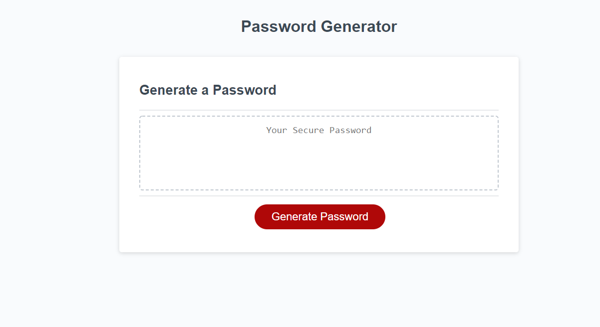
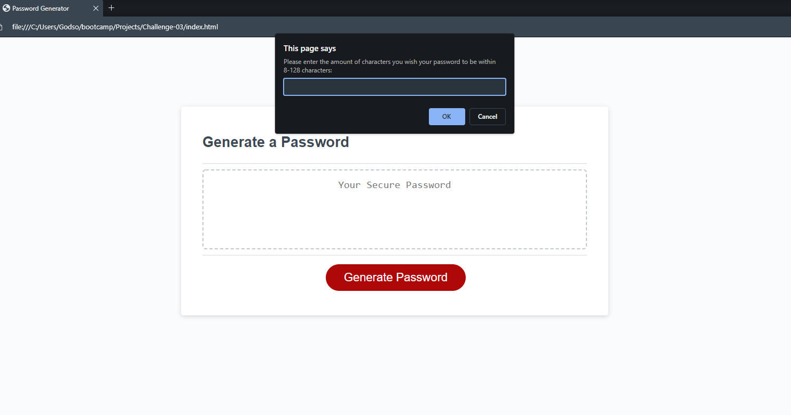

# Password Generator!

## Description
This website is a password generator. On opening the page you will see a title and a box with the words "Generate a Password", a box with "Your secure password" and under the box is a button that says Generate password. Upon clicking the button the window will prompt you to enter a number 8-128. If you click cancel, it will say "Please enter a number!" and the box will now say "Please Try Again!" as an error message. If you enter a value not in the specified range it will notify you to enter a number within the accepted range and display the same error message will appear. When a user enters an acceptable number they are asked a series of questions about which types of characters they want. They can click ok/cancel to add the characters they want and the ones they don't. There's an error message that will appear if they add no characters to their password and they'll have to restart. If they select characters, they will be met with the page updating and giving them a randomized password!

I wanted to make a website that allows users to make a randomly generated password easily while being able to add/subtract specific types of character.

I learned a few things about JavaScript while making this generator. I didn't know/remember that you can use .charAT to select specific characters in a string to not have to type out an array for letters. I also was able to apply and solidify the knowledge about making new strings out of already established strings. 

## Installation
This is N/A as it is a webpage and can be run without installing.

## Usage
This webpage is for being able to make random passwords that are customizable in length and character type. Click the button to start making your own password! Then follow the instructions provided by the window!

Here are some screenshots of the site showing the page on startup and when you click the button.

Here is a link to the live site:
https://fruityokapi.github.io/password-generator/

## Credits
I learned about using strings like arrays in this stack overflow:
https://stackoverflow.com/questions/1349404/generate-random-string-characters-in-javascript

I learned about using remainders to check if a value is an integer here:
https://stackoverflow.com/questions/14636536/how-to-check-if-a-variable-is-an-integer-in-javascript

## License
The license is a default MIT license in the LICENSE.md file